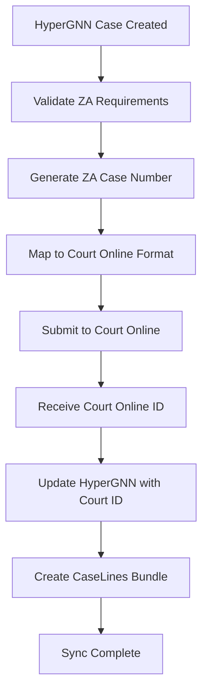
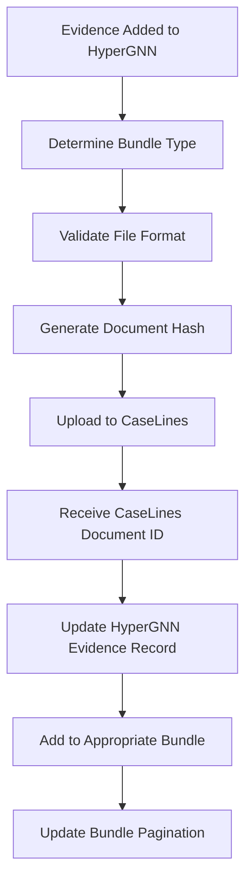
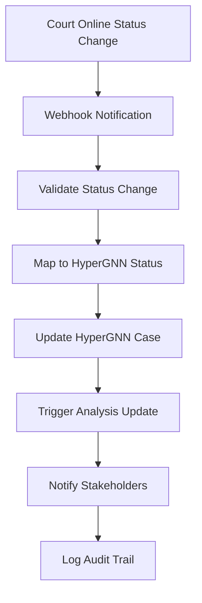

# Data Mapping: HyperGNN ↔ Court Online/CaseLines Integration

## Overview

This document provides comprehensive data mapping between the HyperGNN Analysis Framework and South African judiciary systems (Court Online and CaseLines). The mapping ensures seamless data flow, maintains legal compliance, and preserves analytical capabilities while integrating with official court systems.

## Core Entity Mappings

### 1. Case Management Mapping

#### HyperGNN Cases → Court Online Cases

| HyperGNN Field | Court Online Field | ZA Schema Field | Data Type | Mapping Rules |
|---|---|---|---|---|
| `case_id` | `case_id` | `za_cases.id` | UUID | Direct mapping with UUID format |
| `case_number` | `case_number` | `za_cases.case_number` | VARCHAR(50) | Format: `(COURT_CODE) NUMBER/YEAR` |
| `title` | `case_title` | `za_cases.title` | VARCHAR(500) | Direct mapping, truncated if >500 chars |
| `description` | `case_description` | `za_cases.description` | TEXT | Full description preserved |
| `status` | `case_status` | `za_cases.status` | ENUM | Mapped to ZA court statuses |
| `priority` | `urgency_level` | `za_cases.priority` | ENUM | `urgent`→`urgent`, `high`→`high`, etc. |
| `created_at` | `filing_date` | `za_cases.filing_date` | DATE | Date component only |
| `updated_at` | `last_modified` | `za_cases.updated_at` | TIMESTAMP | Full timestamp preserved |

#### Status Mapping Table

| HyperGNN Status | Court Online Status | ZA Schema Status | Description |
|---|---|---|---|
| `active` | `filed` | `filed` | Case has been filed with court |
| `in_progress` | `served` | `served` | Documents served to parties |
| `pending` | `defended` | `defended` | Defendant has entered plea |
| `trial_ready` | `trial_ready` | `trial_ready` | Case ready for trial |
| `completed` | `judgment` | `judgment` | Judgment has been delivered |
| `closed` | `closed` | `closed` | Case formally closed |
| `archived` | `archived` | `archived` | Case archived for records |

### 2. Party/Entity Mapping

#### HyperGNN Entities → Court Online Parties

| HyperGNN Field | Court Online Field | ZA Schema Field | Mapping Logic |
|---|---|---|---|
| `entity_id` | `party_id` | `za_cases.plaintiff_details.id` | UUID mapping for parties |
| `entity_name` | `party_name` | `za_cases.plaintiff_details.name` | Direct name mapping |
| `entity_type` | `party_type` | `za_cases.plaintiff_details.type` | Type conversion mapping |
| `properties.address` | `party_address` | `za_cases.plaintiff_details.address` | Address extraction from properties |
| `properties.contact` | `party_contact` | `za_cases.plaintiff_details.contact` | Contact details extraction |

#### Entity Type Mapping

| HyperGNN Type | Court Online Type | ZA Legal Context |
|---|---|---|
| `person` | `individual` | Natural person (plaintiff/defendant) |
| `organization` | `corporate` | Corporate entity/company |
| `location` | `address` | Physical address/venue |
| `account` | `financial_entity` | Bank account/financial instrument |
| `asset` | `property` | Physical or intellectual property |
| `event` | `incident` | Legal incident/occurrence |
| `document` | `evidence` | Documentary evidence |

### 3. Evidence Management Mapping

#### HyperGNN Evidence → CaseLines Documents

| HyperGNN Field | CaseLines Field | ZA Schema Field | Data Type | Mapping Rules |
|---|---|---|---|---|
| `evidence_id` | `document_id` | `za_evidence_documents.id` | UUID | Direct UUID mapping |
| `title` | `document_name` | `za_evidence_documents.document_name` | VARCHAR(500) | Document title/name |
| `evidence_type` | `document_type` | `za_evidence_documents.document_type` | ENUM | Evidence type conversion |
| `file_path` | `file_location` | `za_evidence_documents.file_path` | VARCHAR(1000) | File system path |
| `file_size` | `file_size` | `za_evidence_documents.file_size` | BIGINT | File size in bytes |
| `file_hash` | `document_hash` | `za_evidence_documents.file_hash` | VARCHAR(128) | SHA-256 hash |
| `metadata.pages` | `page_count` | `za_evidence_documents.page_count` | INTEGER | Number of pages |
| `created_at` | `upload_date` | `za_evidence_documents.created_at` | TIMESTAMP | Upload timestamp |

#### Evidence Type Mapping

| HyperGNN Type | CaseLines Type | ZA Legal Category | Bundle Placement |
|---|---|---|---|
| `document` | `pleading` | `summons`, `plea`, `affidavit` | Pleadings Bundle |
| `image` | `photograph` | `photographic_evidence` | Discovery Bundle |
| `video` | `video_evidence` | `multimedia_evidence` | Multimedia Bundle |
| `audio` | `audio_recording` | `audio_evidence` | Multimedia Bundle |
| `financial` | `financial_document` | `bank_statement`, `invoice` | Discovery Bundle |
| `communication` | `correspondence` | `email`, `letter` | Correspondence Bundle |
| `physical` | `physical_evidence` | `exhibit` | Trial Bundle |

### 4. Bundle Organization Mapping

#### HyperGNN Evidence Groups → CaseLines Bundles

| HyperGNN Grouping | CaseLines Bundle Type | ZA Schema Bundle Type | Contents |
|---|---|---|---|
| Case Documents | `pleadings` | `pleadings` | Summons, plea, affidavits |
| Investigation Files | `discovery` | `discovery` | Discovered documents, statements |
| Expert Analysis | `expert_reports` | `expert_reports` | Expert opinions, technical reports |
| Communications | `correspondence` | `correspondence` | Emails, letters, notices |
| Media Evidence | `multimedia` | `multimedia` | Photos, videos, audio |
| Trial Materials | `trial_bundle` | `trial_bundle` | Final trial documents |

## Advanced Mapping Scenarios

### 1. Relationship Mapping

#### HyperGNN Relationships → Court Online Case Connections

| HyperGNN Relationship | Court Online Equivalent | ZA Legal Relationship |
|---|---|---|
| `entity_relationships.source_entity_id` | `related_party_1` | Primary party in relationship |
| `entity_relationships.target_entity_id` | `related_party_2` | Secondary party in relationship |
| `entity_relationships.relationship_type` | `relationship_nature` | Legal nature of relationship |
| `entity_relationships.strength` | `relevance_score` | Legal relevance (0.0-1.0) |

#### Relationship Type Mapping

| HyperGNN Type | Court Online Type | ZA Legal Context |
|---|---|---|
| `owns` | `ownership` | Property/asset ownership |
| `employed_by` | `employment` | Employment relationship |
| `director_of` | `directorship` | Corporate directorship |
| `related_to` | `family_relation` | Family relationship |
| `transacted_with` | `business_relation` | Business transaction |
| `communicated_with` | `correspondence` | Communication record |

### 2. Timeline Integration

#### HyperGNN Timeline → Court Online Case Timeline

| HyperGNN Field | Court Online Field | ZA Schema Field | Purpose |
|---|---|---|---|
| `timeline_events.event_date` | `event_date` | `za_court_proceedings.proceeding_date` | Court hearing dates |
| `timeline_events.title` | `event_title` | `za_court_proceedings.proceeding_type` | Type of proceeding |
| `timeline_events.description` | `event_description` | `za_court_proceedings.orders_made` | Court orders/outcomes |
| `timeline_events.participants` | `attendees` | `za_court_proceedings.attending_parties` | Parties present |

### 3. Legal Practitioner Mapping

#### HyperGNN Users → Court Online Legal Practitioners

| HyperGNN Field | Court Online Field | ZA Schema Field | Validation |
|---|---|---|---|
| `users.username` | `practitioner_id` | `za_legal_practitioners.practitioner_number` | Law Society number |
| `users.email` | `email_address` | `za_legal_practitioners.contact_details.email` | Valid email format |
| `users.role` | `practitioner_type` | `za_legal_practitioners.practitioner_type` | Attorney/Advocate |
| `users.permissions` | `access_level` | `za_legal_practitioners.practice_areas` | Practice area permissions |

## Data Transformation Rules

### 1. Format Conversions

#### Case Number Generation
```sql
-- HyperGNN internal ID to ZA case number
FUNCTION generate_za_case_number(court_code VARCHAR, sequence_number INTEGER, year INTEGER)
RETURNS VARCHAR(50)
AS $$
BEGIN
    RETURN CONCAT('(', court_code, ') ', LPAD(sequence_number::TEXT, 5, '0'), '/', year);
END;
$$;

-- Example: generate_za_case_number('GP', 12345, 2025) → '(GP) 12345/2025'
```

#### Date/Time Conversions
```sql
-- Convert HyperGNN timestamps to Court Online date format
FUNCTION convert_to_court_date(hypergnn_timestamp TIMESTAMP WITH TIME ZONE)
RETURNS DATE
AS $$
BEGIN
    RETURN hypergnn_timestamp::DATE;
END;
$$;
```

### 2. Data Validation Rules

#### Court Online Validation
- Case numbers must match pattern: `^\([A-Z]{2,3}\)\s*\d{4,6}\/\d{4}$`
- Filing dates cannot be in the future
- Party names must be non-empty and < 255 characters
- Document file sizes must be < 50MB for Court Online

#### CaseLines Validation
- Bundle names must be unique within a case
- Document page counts must be positive integers
- File hashes must be SHA-256 format (64 characters)
- Bundle types must match predefined CaseLines categories

### 3. Bidirectional Sync Rules

#### HyperGNN → Court Online (Push)
```python
def sync_case_to_court_online(hypergnn_case):
    court_online_case = {
        'case_id': hypergnn_case['id'],
        'case_number': generate_za_case_number(
            hypergnn_case['court_code'],
            hypergnn_case['sequence'],
            hypergnn_case['year']
        ),
        'case_title': hypergnn_case['title'][:500],  # Truncate if needed
        'filing_date': hypergnn_case['created_at'].date(),
        'case_status': map_status_to_court_online(hypergnn_case['status']),
        'parties': map_entities_to_parties(hypergnn_case['entities'])
    }
    return court_online_case
```

#### Court Online → HyperGNN (Pull)
```python
def sync_case_from_court_online(court_online_case):
    hypergnn_case = {
        'id': court_online_case['case_id'],
        'case_number': court_online_case['case_number'],
        'title': court_online_case['case_title'],
        'status': map_status_from_court_online(court_online_case['case_status']),
        'created_at': court_online_case['filing_date'],
        'court_integration': {
            'court_online_id': court_online_case['case_id'],
            'last_sync': datetime.now(),
            'sync_status': 'active'
        }
    }
    return hypergnn_case
```

## Integration Workflows

### 1. Case Creation Workflow



### 2. Evidence Upload Workflow



### 3. Status Synchronization Workflow



## Error Handling and Data Quality

### 1. Mapping Conflicts

| Conflict Type | Resolution Strategy | Fallback Action |
|---|---|---|
| Invalid case number format | Auto-generate valid format | Use system-generated number |
| Missing required fields | Prompt user for input | Use default values where legal |
| File size exceeds limits | Compress or split files | Store reference to external location |
| Duplicate case numbers | Append sequence suffix | Generate new unique number |

### 2. Data Quality Checks

#### Pre-Sync Validation
- Verify all required fields are present
- Validate data formats and constraints
- Check file integrity and accessibility
- Confirm user permissions and access rights

#### Post-Sync Verification
- Confirm successful data transfer
- Validate data integrity in target system
- Check for any data loss or corruption
- Verify all relationships are maintained

### 3. Audit and Compliance

#### Audit Trail Mapping
| HyperGNN Audit Field | ZA Audit Field | Purpose |
|---|---|---|
| `action_type` | `za_audit_trail.action_type` | Type of action performed |
| `user_id` | `za_audit_trail.user_id` | User who performed action |
| `timestamp` | `za_audit_trail.created_at` | When action occurred |
| `old_values` | `za_audit_trail.old_values` | Previous data state |
| `new_values` | `za_audit_trail.new_values` | New data state |

## Performance Considerations

### 1. Batch Processing

Large data sets are processed in batches to maintain system performance:
- Case synchronization: 100 cases per batch
- Evidence upload: 50 documents per batch
- Status updates: Real-time for critical changes, batched for routine updates

### 2. Caching Strategy

Frequently accessed mappings are cached to improve performance:
- Court registry data: 24-hour cache
- Case type mappings: 1-hour cache
- User permissions: 30-minute cache
- Document metadata: 15-minute cache

### 3. Indexing Strategy

Database indexes are optimized for mapping operations:
- `za_cases.case_number` - Unique index for fast lookups
- `za_cases.court_online_case_id` - Index for integration queries
- `za_evidence_documents.caselines_document_id` - Index for CaseLines sync
- `za_audit_trail.created_at` - Index for audit queries

This comprehensive data mapping ensures seamless integration between HyperGNN's analytical capabilities and South Africa's official judiciary systems while maintaining data integrity, legal compliance, and optimal performance.
